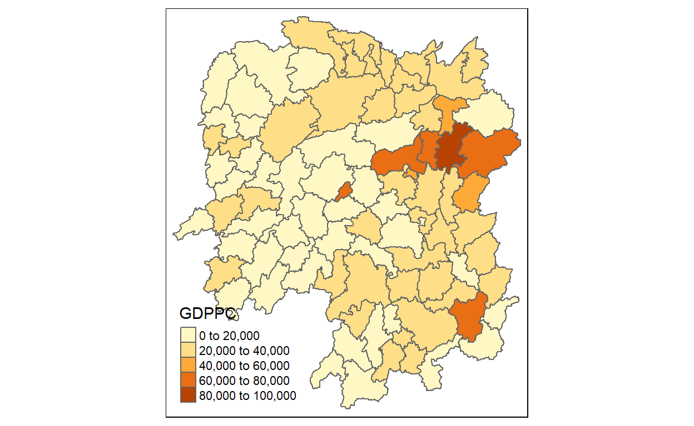
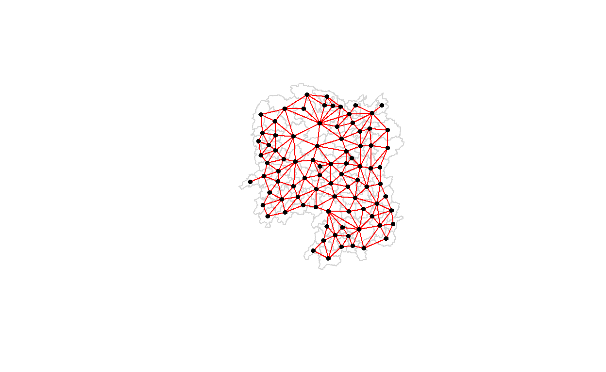
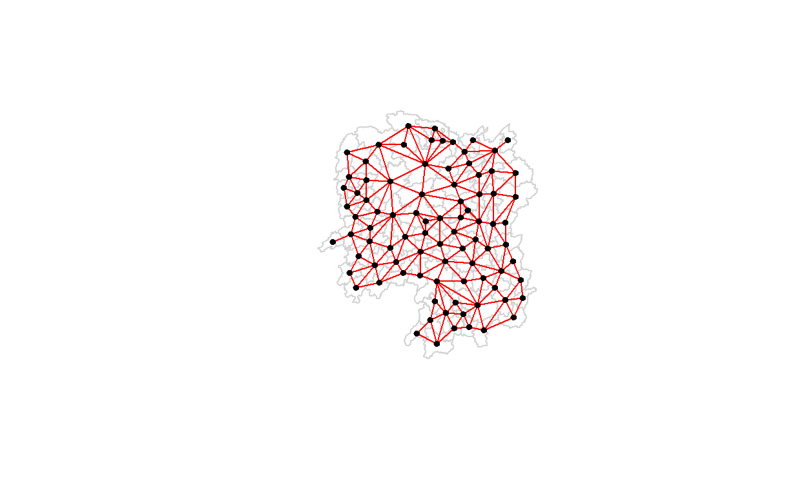
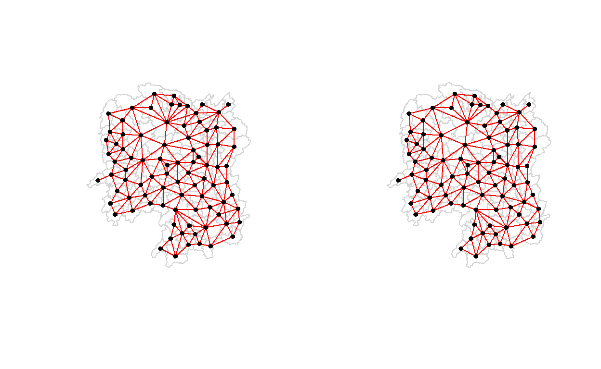
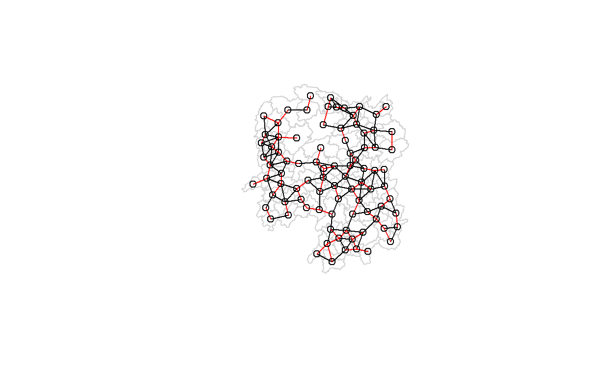
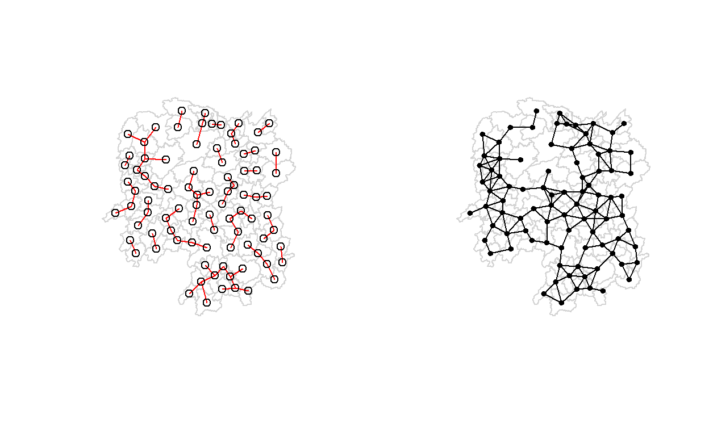
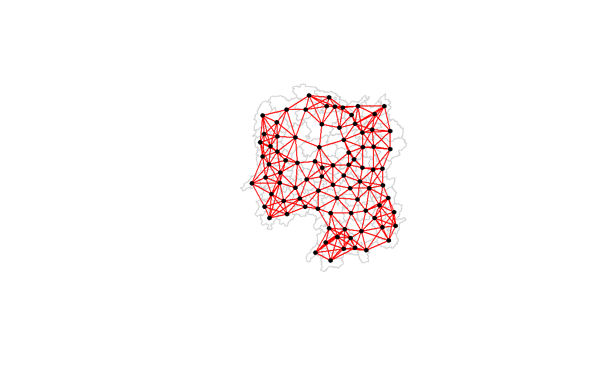
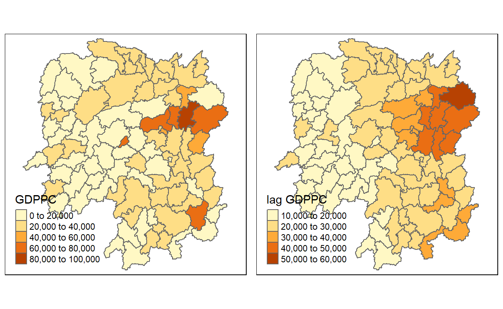
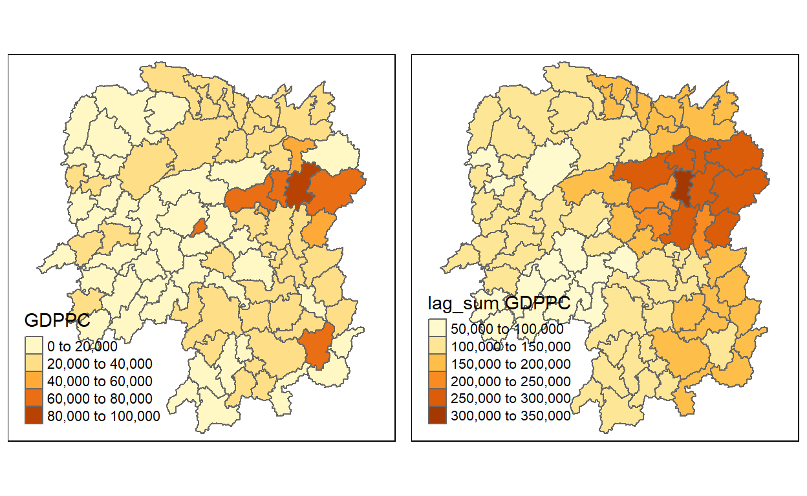

## Getting Started

In this hands-on exercise, the following r packages will be used :

- import geospatial data using appropriate function(s) of rgdal package,
- import csv file using appropriate function of readr package,
- perform relational join using appropriate join function of dplyr package,
- compute spatial weights using appropriate R functions, and
- calculate spatially lag attributes using appropriate functions of spdep package.

<div class="layout-chunk" data-layout="l-body">


</div>


## Loading Data Into R 

### Import shapefile into r environment

The code chunk below uses st_read() of sf package to import Hunan shapefile into R. The imported shapefile will be simple features Object of sf.

<div class="layout-chunk" data-layout="l-body">

```
Reading layer `Hunan' from data source 
  `C:\Users\User\Desktop\IS415\lye-jia-wei\IS415_blog\_posts\2021-09-17-hands-on-exercise-6\data\geospatial' 
  using driver `ESRI Shapefile'
Simple feature collection with 88 features and 7 fields
Geometry type: POLYGON
Dimension:     XY
Bounding box:  xmin: 108.7831 ymin: 24.6342 xmax: 114.2544 ymax: 30.12812
Geodetic CRS:  WGS 84
```

</div>


### Import csv file into r environment

Next, we will import Hunan_2012.csv into R by using read_csv() of readr package. The output is R dataframe class.

<div class="layout-chunk" data-layout="l-body">


</div>


## Performing relational join

The code chunk below will be used to update the attribute table of hunan’s SpatialPolygonsDataFrame with the attribute fields of hunan2012 dataframe. This is performed by using left_join() of dplyr package.

<div class="layout-chunk" data-layout="l-body">


</div>


## Visualising Regional Development Indicator

Now, we are going to prepare a choropleth map showing the distribution of GDPPC 2012 by using qtm() of tmap package.

<div class="layout-chunk" data-layout="l-body">


</div>


## Computing Contiguity Spatial Weights

### Computing (QUEEN) contiguity based neighbours


The code chunk below is used to compute Queen contiguity weight matrix.

<div class="layout-chunk" data-layout="l-body">

```
Neighbour list object:
Number of regions: 88 
Number of nonzero links: 448 
Percentage nonzero weights: 5.785124 
Average number of links: 5.090909 
Link number distribution:

 1  2  3  4  5  6  7  8  9 11 
 2  2 12 16 24 14 11  4  2  1 
2 least connected regions:
30 65 with 1 link
1 most connected region:
85 with 11 links
```

</div>


The summary report above shows that there are 88 area units in Hunan. The most connected area unit has 11 neighbours. There are two area units with only one heighbours.

For each polygon in our polygon object, wm_q lists all neighboring polygons. For example, to see the neighbors for the first polygon in the object, type:

<div class="layout-chunk" data-layout="l-body">

```
[1]  2  3  4 57 85
```

</div>


Polygon 1 has 5 neighbors. The numbers represent the polygon IDs as stored in hunan SpatialPolygonsDataFrame class.

We can retrive the county name of Polygon ID=1 by using the code chunk below:

<div class="layout-chunk" data-layout="l-body">

```
[1] "Anxiang"
```

</div>


The output reveals that Polygon ID=1 is Anxiang county.

To reveal the county names of the five neighboring polygons, the code chunk will be used:

<div class="layout-chunk" data-layout="l-body">

```
[1] "Hanshou" "Jinshi"  "Li"      "Nan"     "Taoyuan"
```

</div>


Display the complete weight matrix by using str().

<div class="layout-chunk" data-layout="l-body">

```
List of 88
 $ : int [1:5] 2 3 4 57 85
 $ : int [1:5] 1 57 58 78 85
 $ : int [1:4] 1 4 5 85
 $ : int [1:4] 1 3 5 6
 $ : int [1:4] 3 4 6 85
 $ : int [1:5] 4 5 69 75 85
 $ : int [1:4] 67 71 74 84
 $ : int [1:7] 9 46 47 56 78 80 86
 $ : int [1:6] 8 66 68 78 84 86
 $ : int [1:8] 16 17 19 20 22 70 72 73
 $ : int [1:3] 14 17 72
 $ : int [1:5] 13 60 61 63 83
 $ : int [1:4] 12 15 60 83
 $ : int [1:3] 11 15 17
 $ : int [1:4] 13 14 17 83
 $ : int [1:5] 10 17 22 72 83
 $ : int [1:7] 10 11 14 15 16 72 83
 $ : int [1:5] 20 22 23 77 83
 $ : int [1:6] 10 20 21 73 74 86
 $ : int [1:7] 10 18 19 21 22 23 82
 $ : int [1:5] 19 20 35 82 86
 $ : int [1:5] 10 16 18 20 83
 $ : int [1:7] 18 20 38 41 77 79 82
 $ : int [1:5] 25 28 31 32 54
 $ : int [1:5] 24 28 31 33 81
 $ : int [1:4] 27 33 42 81
 $ : int [1:3] 26 29 42
 $ : int [1:5] 24 25 33 49 54
 $ : int [1:3] 27 37 42
 $ : int 33
 $ : int [1:8] 24 25 32 36 39 40 56 81
 $ : int [1:8] 24 31 50 54 55 56 75 85
 $ : int [1:5] 25 26 28 30 81
 $ : int [1:3] 36 45 80
 $ : int [1:6] 21 41 47 80 82 86
 $ : int [1:6] 31 34 40 45 56 80
 $ : int [1:4] 29 42 43 44
 $ : int [1:4] 23 44 77 79
 $ : int [1:5] 31 40 42 43 81
 $ : int [1:6] 31 36 39 43 45 79
 $ : int [1:6] 23 35 45 79 80 82
 $ : int [1:7] 26 27 29 37 39 43 81
 $ : int [1:6] 37 39 40 42 44 79
 $ : int [1:4] 37 38 43 79
 $ : int [1:6] 34 36 40 41 79 80
 $ : int [1:3] 8 47 86
 $ : int [1:5] 8 35 46 80 86
 $ : int [1:5] 50 51 52 53 55
 $ : int [1:4] 28 51 52 54
 $ : int [1:5] 32 48 52 54 55
 $ : int [1:3] 48 49 52
 $ : int [1:5] 48 49 50 51 54
 $ : int [1:3] 48 55 75
 $ : int [1:6] 24 28 32 49 50 52
 $ : int [1:5] 32 48 50 53 75
 $ : int [1:7] 8 31 32 36 78 80 85
 $ : int [1:6] 1 2 58 64 76 85
 $ : int [1:5] 2 57 68 76 78
 $ : int [1:4] 60 61 87 88
 $ : int [1:4] 12 13 59 61
 $ : int [1:7] 12 59 60 62 63 77 87
 $ : int [1:3] 61 77 87
 $ : int [1:4] 12 61 77 83
 $ : int [1:2] 57 76
 $ : int 76
 $ : int [1:5] 9 67 68 76 84
 $ : int [1:4] 7 66 76 84
 $ : int [1:5] 9 58 66 76 78
 $ : int [1:3] 6 75 85
 $ : int [1:3] 10 72 73
 $ : int [1:3] 7 73 74
 $ : int [1:5] 10 11 16 17 70
 $ : int [1:5] 10 19 70 71 74
 $ : int [1:6] 7 19 71 73 84 86
 $ : int [1:6] 6 32 53 55 69 85
 $ : int [1:7] 57 58 64 65 66 67 68
 $ : int [1:7] 18 23 38 61 62 63 83
 $ : int [1:7] 2 8 9 56 58 68 85
 $ : int [1:7] 23 38 40 41 43 44 45
 $ : int [1:8] 8 34 35 36 41 45 47 56
 $ : int [1:6] 25 26 31 33 39 42
 $ : int [1:5] 20 21 23 35 41
 $ : int [1:9] 12 13 15 16 17 18 22 63 77
 $ : int [1:6] 7 9 66 67 74 86
 $ : int [1:11] 1 2 3 5 6 32 56 57 69 75 ...
 $ : int [1:9] 8 9 19 21 35 46 47 74 84
 $ : int [1:4] 59 61 62 88
 $ : int [1:2] 59 87
 - attr(*, "class")= chr "nb"
 - attr(*, "region.id")= chr [1:88] "1" "2" "3" "4" ...
 - attr(*, "call")= language poly2nb(pl = hunan, queen = TRUE)
 - attr(*, "type")= chr "queen"
 - attr(*, "sym")= logi TRUE
```

</div>


### Creating (ROOK) contiguity based neighbours

The code chunk below is used to compute Rook contiguity weight matrix.

<div class="layout-chunk" data-layout="l-body">

```
Neighbour list object:
Number of regions: 88 
Number of nonzero links: 440 
Percentage nonzero weights: 5.681818 
Average number of links: 5 
Link number distribution:

 1  2  3  4  5  6  7  8  9 10 
 2  2 12 20 21 14 11  3  2  1 
2 least connected regions:
30 65 with 1 link
1 most connected region:
85 with 10 links
```

</div>


The summary report above shows that there are 88 area units in Hunan. The most connect area unit has 10 neighbours. There are two area units with only one heighbours.


## Visualising contiguity weights


To get our longitude values we map the st_centroid function over the geometry column of us.bound and access the longitude value through double bracket notation [[]] and 1. This allows us to get only the longitude, which is the first value in each centroid.

<div class="layout-chunk" data-layout="l-body">


</div>


We do the same for latitude with one key difference. We access the second value per each centroid with [[2]].

<div class="layout-chunk" data-layout="l-body">


</div>


Use cbind to put longitude and latitude into the same object.

<div class="layout-chunk" data-layout="l-body">


</div>


We check the first few observations to see if things are formatted correctly.

<div class="layout-chunk" data-layout="l-body">

```
     longitude latitude
[1,]  112.1531 29.44362
[2,]  112.0372 28.86489
[3,]  111.8917 29.47107
[4,]  111.7031 29.74499
[5,]  111.6138 29.49258
[6,]  111.0341 29.79863
```

</div>


Plotting Queen contiguity based neighbours maps

<div class="layout-chunk" data-layout="l-body">


</div>


Plotting Rook contiguity based neighbours maps

<div class="layout-chunk" data-layout="l-body">


</div>


<div class="layout-chunk" data-layout="l-body">


</div>


## Computing distance based neighbours


### Determine the cut-off distance

Firstly, we need to determine the upper limit for distance band by using the steps below:

+ Return a matrix with the indices of points belonging to the set of the k nearest neighbours of each other by using knearneigh() of spdep.

+ Convert the knn object returned by knearneigh() into a neighbours list of class nb with a list of integer vectors containing neighbour region number ids by using knn2nb().

+ Return the length of neighbour relationship edges by using nbdists() of spdep. The function returns in the units of the coordinates if the coordinates are projected, in km otherwise.

+ Remove the list structure of the returned object by using unlist().

<div class="layout-chunk" data-layout="l-body">

```
   Min. 1st Qu.  Median    Mean 3rd Qu.    Max. 
  24.79   32.57   38.01   39.07   44.52   61.79 
```

</div>


The summary report shows that the largest first nearest neighbour distance is 61.79 km, so using this as the upper threshold gives certainty that all units will have at least one neighbour.

## Computing fixed distance weight matrix

Now, we will compute the distance weight matrix by using dnearneigh() as shown in the code chunk below.

<div class="layout-chunk" data-layout="l-body">

```
Neighbour list object:
Number of regions: 88 
Number of nonzero links: 324 
Percentage nonzero weights: 4.183884 
Average number of links: 3.681818 
```

</div>


Average number of links: 3.681818” shown above means about 4 neighbours


Display the structure of the weight matrix by combining table() and card() of spdep.

<div class="layout-chunk" data-layout="l-body">

```
               
                1 2 3 4 5 6
  Anhua         1 0 0 0 0 0
  Anren         0 0 0 1 0 0
  Anxiang       0 0 0 0 1 0
  Baojing       0 0 0 0 1 0
  Chaling       0 0 1 0 0 0
  Changning     0 0 1 0 0 0
  Changsha      0 0 0 1 0 0
  Chengbu       0 1 0 0 0 0
  Chenxi        0 0 0 1 0 0
  Cili          0 1 0 0 0 0
  Dao           0 0 0 1 0 0
  Dongan        0 0 1 0 0 0
  Dongkou       0 0 0 1 0 0
  Fenghuang     0 0 0 1 0 0
  Guidong       0 0 1 0 0 0
  Guiyang       0 0 0 1 0 0
  Guzhang       0 0 0 0 0 1
  Hanshou       0 0 0 1 0 0
  Hengdong      0 0 0 0 1 0
  Hengnan       0 0 0 0 1 0
  Hengshan      0 0 0 0 0 1
  Hengyang      0 0 0 0 0 1
  Hongjiang     0 0 0 0 1 0
  Huarong       0 0 0 1 0 0
  Huayuan       0 0 0 1 0 0
  Huitong       0 0 0 1 0 0
  Jiahe         0 0 0 0 1 0
  Jianghua      0 0 1 0 0 0
  Jiangyong     0 1 0 0 0 0
  Jingzhou      0 1 0 0 0 0
  Jinshi        0 0 0 1 0 0
  Jishou        0 0 0 0 0 1
  Lanshan       0 0 0 1 0 0
  Leiyang       0 0 0 1 0 0
  Lengshuijiang 0 0 1 0 0 0
  Li            0 0 1 0 0 0
  Lianyuan      0 0 0 0 1 0
  Liling        0 1 0 0 0 0
  Linli         0 0 0 1 0 0
  Linwu         0 0 0 1 0 0
  Linxiang      1 0 0 0 0 0
  Liuyang       0 1 0 0 0 0
  Longhui       0 0 1 0 0 0
  Longshan      0 1 0 0 0 0
  Luxi          0 0 0 0 1 0
  Mayang        0 0 0 0 0 1
  Miluo         0 0 0 0 1 0
  Nan           0 0 0 0 1 0
  Ningxiang     0 0 0 1 0 0
  Ningyuan      0 0 0 0 1 0
  Pingjiang     0 1 0 0 0 0
  Qidong        0 0 1 0 0 0
  Qiyang        0 0 1 0 0 0
  Rucheng       0 1 0 0 0 0
  Sangzhi       0 1 0 0 0 0
  Shaodong      0 0 0 0 1 0
  Shaoshan      0 0 0 0 1 0
  Shaoyang      0 0 0 1 0 0
  Shimen        1 0 0 0 0 0
  Shuangfeng    0 0 0 0 0 1
  Shuangpai     0 0 0 1 0 0
  Suining       0 0 0 0 1 0
  Taojiang      0 1 0 0 0 0
  Taoyuan       0 1 0 0 0 0
  Tongdao       0 1 0 0 0 0
  Wangcheng     0 0 0 1 0 0
  Wugang        0 0 1 0 0 0
  Xiangtan      0 0 0 1 0 0
  Xiangxiang    0 0 0 0 1 0
  Xiangyin      0 0 0 1 0 0
  Xinhua        0 0 0 0 1 0
  Xinhuang      1 0 0 0 0 0
  Xinning       0 1 0 0 0 0
  Xinshao       0 0 0 0 0 1
  Xintian       0 0 0 0 1 0
  Xupu          0 1 0 0 0 0
  Yanling       0 0 1 0 0 0
  Yizhang       1 0 0 0 0 0
  Yongshun      0 0 0 1 0 0
  Yongxing      0 0 0 1 0 0
  You           0 0 0 1 0 0
  Yuanjiang     0 0 0 0 1 0
  Yuanling      1 0 0 0 0 0
  Yueyang       0 0 1 0 0 0
  Zhijiang      0 0 0 0 1 0
  Zhongfang     0 0 0 1 0 0
  Zhuzhou       0 0 0 0 1 0
  Zixing        0 0 1 0 0 0
```

</div>


## Plotting fixed distance weight matrix

Next, we will plot the distance weight matrix by using the code chunk below.

<div class="layout-chunk" data-layout="l-body">


</div>


The red lines show the links of 1st nearest neighbours and the black lines show the links of neighbours within the cut-off distance of 62km.

Alternatively, we can plot both of them next to each other by using the code chunk below.

<div class="layout-chunk" data-layout="l-body">


</div>


## Computing adaptive distance weight matrix

Control the numbers of neighbours directly using k-nearest neighbours, either accepting asymmetric neighbours or imposing symmetry as shown in the code chunk below.

<div class="layout-chunk" data-layout="l-body">

```
Neighbour list object:
Number of regions: 88 
Number of nonzero links: 528 
Percentage nonzero weights: 6.818182 
Average number of links: 6 
Non-symmetric neighbours list
```

</div>


## Plotting distance based neighbours

We can plot the weight matrix using the code chunk below.


<div class="layout-chunk" data-layout="l-body">


</div>

## Weights based on IDW


First, we will compute the distances between areas by using nbdists() of spdep.

<div class="layout-chunk" data-layout="l-body">

```
[[1]]
[1] 0.01535405 0.03916350 0.01820896 0.02807922 0.01145113

[[2]]
[1] 0.01535405 0.01764308 0.01925924 0.02323898 0.01719350

[[3]]
[1] 0.03916350 0.02822040 0.03695795 0.01395765

[[4]]
[1] 0.01820896 0.02822040 0.03414741 0.01539065

[[5]]
[1] 0.03695795 0.03414741 0.01524598 0.01618354

[[6]]
[1] 0.015390649 0.015245977 0.021748129 0.011883901 0.009810297

[[7]]
[1] 0.01708612 0.01473997 0.01150924 0.01872915

[[8]]
[1] 0.02022144 0.03453056 0.02529256 0.01036340 0.02284457 0.01500600
[7] 0.01515314

[[9]]
[1] 0.02022144 0.01574888 0.02109502 0.01508028 0.02902705 0.01502980

[[10]]
[1] 0.02281552 0.01387777 0.01538326 0.01346650 0.02100510 0.02631658
[7] 0.01874863 0.01500046

[[11]]
[1] 0.01882869 0.02243492 0.02247473

[[12]]
[1] 0.02779227 0.02419652 0.02333385 0.02986130 0.02335429

[[13]]
[1] 0.02779227 0.02650020 0.02670323 0.01714243

[[14]]
[1] 0.01882869 0.01233868 0.02098555

[[15]]
[1] 0.02650020 0.01233868 0.01096284 0.01562226

[[16]]
[1] 0.02281552 0.02466962 0.02765018 0.01476814 0.01671430

[[17]]
[1] 0.01387777 0.02243492 0.02098555 0.01096284 0.02466962 0.01593341
[7] 0.01437996

[[18]]
[1] 0.02039779 0.02032767 0.01481665 0.01473691 0.01459380

[[19]]
[1] 0.01538326 0.01926323 0.02668415 0.02140253 0.01613589 0.01412874

[[20]]
[1] 0.01346650 0.02039779 0.01926323 0.01723025 0.02153130 0.01469240
[7] 0.02327034

[[21]]
[1] 0.02668415 0.01723025 0.01766299 0.02644986 0.02163800

[[22]]
[1] 0.02100510 0.02765018 0.02032767 0.02153130 0.01489296

[[23]]
[1] 0.01481665 0.01469240 0.01401432 0.02246233 0.01880425 0.01530458
[7] 0.01849605

[[24]]
[1] 0.02354598 0.01837201 0.02607264 0.01220154 0.02514180

[[25]]
[1] 0.02354598 0.02188032 0.01577283 0.01949232 0.02947957

[[26]]
[1] 0.02155798 0.01745522 0.02212108 0.02220532

[[27]]
[1] 0.02155798 0.02490625 0.01562326

[[28]]
[1] 0.01837201 0.02188032 0.02229549 0.03076171 0.02039506

[[29]]
[1] 0.02490625 0.01686587 0.01395022

[[30]]
[1] 0.02090587

[[31]]
[1] 0.02607264 0.01577283 0.01219005 0.01724850 0.01229012 0.01609781
[7] 0.01139438 0.01150130

[[32]]
[1] 0.01220154 0.01219005 0.01712515 0.01340413 0.01280928 0.01198216
[7] 0.01053374 0.01065655

[[33]]
[1] 0.01949232 0.01745522 0.02229549 0.02090587 0.01979045

[[34]]
[1] 0.03113041 0.03589551 0.02882915

[[35]]
[1] 0.01766299 0.02185795 0.02616766 0.02111721 0.02108253 0.01509020

[[36]]
[1] 0.01724850 0.03113041 0.01571707 0.01860991 0.02073549 0.01680129

[[37]]
[1] 0.01686587 0.02234793 0.01510990 0.01550676

[[38]]
[1] 0.01401432 0.02407426 0.02276151 0.01719415

[[39]]
[1] 0.01229012 0.02172543 0.01711924 0.02629732 0.01896385

[[40]]
[1] 0.01609781 0.01571707 0.02172543 0.01506473 0.01987922 0.01894207

[[41]]
[1] 0.02246233 0.02185795 0.02205991 0.01912542 0.01601083 0.01742892

[[42]]
[1] 0.02212108 0.01562326 0.01395022 0.02234793 0.01711924 0.01836831
[7] 0.01683518

[[43]]
[1] 0.01510990 0.02629732 0.01506473 0.01836831 0.03112027 0.01530782

[[44]]
[1] 0.01550676 0.02407426 0.03112027 0.01486508

[[45]]
[1] 0.03589551 0.01860991 0.01987922 0.02205991 0.02107101 0.01982700

[[46]]
[1] 0.03453056 0.04033752 0.02689769

[[47]]
[1] 0.02529256 0.02616766 0.04033752 0.01949145 0.02181458

[[48]]
[1] 0.02313819 0.03370576 0.02289485 0.01630057 0.01818085

[[49]]
[1] 0.03076171 0.02138091 0.02394529 0.01990000

[[50]]
[1] 0.01712515 0.02313819 0.02551427 0.02051530 0.02187179

[[51]]
[1] 0.03370576 0.02138091 0.02873854

[[52]]
[1] 0.02289485 0.02394529 0.02551427 0.02873854 0.03516672

[[53]]
[1] 0.01630057 0.01979945 0.01253977

[[54]]
[1] 0.02514180 0.02039506 0.01340413 0.01990000 0.02051530 0.03516672

[[55]]
[1] 0.01280928 0.01818085 0.02187179 0.01979945 0.01882298

[[56]]
[1] 0.01036340 0.01139438 0.01198216 0.02073549 0.01214479 0.01362855
[7] 0.01341697

[[57]]
[1] 0.028079221 0.017643082 0.031423501 0.029114131 0.013520292
[6] 0.009903702

[[58]]
[1] 0.01925924 0.03142350 0.02722997 0.01434859 0.01567192

[[59]]
[1] 0.01696711 0.01265572 0.01667105 0.01785036

[[60]]
[1] 0.02419652 0.02670323 0.01696711 0.02343040

[[61]]
[1] 0.02333385 0.01265572 0.02343040 0.02514093 0.02790764 0.01219751
[7] 0.02362452

[[62]]
[1] 0.02514093 0.02002219 0.02110260

[[63]]
[1] 0.02986130 0.02790764 0.01407043 0.01805987

[[64]]
[1] 0.02911413 0.01689892

[[65]]
[1] 0.02471705

[[66]]
[1] 0.01574888 0.01726461 0.03068853 0.01954805 0.01810569

[[67]]
[1] 0.01708612 0.01726461 0.01349843 0.01361172

[[68]]
[1] 0.02109502 0.02722997 0.03068853 0.01406357 0.01546511

[[69]]
[1] 0.02174813 0.01645838 0.01419926

[[70]]
[1] 0.02631658 0.01963168 0.02278487

[[71]]
[1] 0.01473997 0.01838483 0.03197403

[[72]]
[1] 0.01874863 0.02247473 0.01476814 0.01593341 0.01963168

[[73]]
[1] 0.01500046 0.02140253 0.02278487 0.01838483 0.01652709

[[74]]
[1] 0.01150924 0.01613589 0.03197403 0.01652709 0.01342099 0.02864567

[[75]]
[1] 0.011883901 0.010533736 0.012539774 0.018822977 0.016458383
[6] 0.008217581

[[76]]
[1] 0.01352029 0.01434859 0.01689892 0.02471705 0.01954805 0.01349843
[7] 0.01406357

[[77]]
[1] 0.014736909 0.018804247 0.022761507 0.012197506 0.020022195
[6] 0.014070428 0.008440896

[[78]]
[1] 0.02323898 0.02284457 0.01508028 0.01214479 0.01567192 0.01546511
[7] 0.01140779

[[79]]
[1] 0.01530458 0.01719415 0.01894207 0.01912542 0.01530782 0.01486508
[7] 0.02107101

[[80]]
[1] 0.01500600 0.02882915 0.02111721 0.01680129 0.01601083 0.01982700
[7] 0.01949145 0.01362855

[[81]]
[1] 0.02947957 0.02220532 0.01150130 0.01979045 0.01896385 0.01683518

[[82]]
[1] 0.02327034 0.02644986 0.01849605 0.02108253 0.01742892

[[83]]
[1] 0.023354289 0.017142433 0.015622258 0.016714303 0.014379961
[6] 0.014593799 0.014892965 0.018059871 0.008440896

[[84]]
[1] 0.01872915 0.02902705 0.01810569 0.01361172 0.01342099 0.01297994

[[85]]
 [1] 0.011451133 0.017193502 0.013957649 0.016183544 0.009810297
 [6] 0.010656545 0.013416965 0.009903702 0.014199260 0.008217581
[11] 0.011407794

[[86]]
[1] 0.01515314 0.01502980 0.01412874 0.02163800 0.01509020 0.02689769
[7] 0.02181458 0.02864567 0.01297994

[[87]]
[1] 0.01667105 0.02362452 0.02110260 0.02058034

[[88]]
[1] 0.01785036 0.02058034
```

</div>


## Row-standardised weights matrix

Next, we need to assign weights to each neighboring polygon. In our case, each neighboring polygon will be assigned equal weight (style=“W”). This is accomplished by assigning the fraction 1/(#ofneighbors) to each neighboring county then summing the weighted income values. While this is the most intuitive way to summaries the neighbors’ values it has one drawback in that polygons along the edges of the study area will base their lagged values on fewer polygons thus potentially over- or under-estimating the true nature of the spatial autocorrelation in the data. For this example, we’ll stick with the style=“W” option for simplicity’s sake but note that other more robust options are available, notably style=“B”.

<div class="layout-chunk" data-layout="l-body">

```
Characteristics of weights list object:
Neighbour list object:
Number of regions: 88 
Number of nonzero links: 448 
Percentage nonzero weights: 5.785124 
Average number of links: 5.090909 

Weights style: W 
Weights constants summary:
   n   nn S0       S1       S2
W 88 7744 88 37.86334 365.9147
```

</div>


To see the weight of the first polygon’s four neighbors type:

<div class="layout-chunk" data-layout="l-body">

```
[[1]]
[1] 0.125 0.125 0.125 0.125 0.125 0.125 0.125 0.125
```

</div>


Each neighbor is assigned a 0.2 of the total weight. This means that when R computes the average neighboring income values, each neighbor’s income will be multiplied by 0.2 before being tallied.

Using the same method, we can also derive a row standardised distance weight matrix by using the code chunk below.

<div class="layout-chunk" data-layout="l-body">

```
Characteristics of weights list object:
Neighbour list object:
Number of regions: 88 
Number of nonzero links: 448 
Percentage nonzero weights: 5.785124 
Average number of links: 5.090909 

Weights style: B 
Weights constants summary:
   n   nn       S0        S1     S2
B 88 7744 8.786867 0.3776535 3.8137
```

</div>


## Application of Spatial Weight Matrix

### Spatial lag with row-standardized weights

Finally, we’ll compute the average neighbor GDPPC value for each polygon. These values are often referred to as spatially lagged values.

<div class="layout-chunk" data-layout="l-body">

```
 [1] 24847.20 22724.80 24143.25 27737.50 27270.25 21248.80 43747.00
 [8] 33582.71 45651.17 32027.62 32671.00 20810.00 25711.50 30672.33
[15] 33457.75 31689.20 20269.00 23901.60 25126.17 21903.43 22718.60
[22] 25918.80 20307.00 20023.80 16576.80 18667.00 14394.67 19848.80
[29] 15516.33 20518.00 17572.00 15200.12 18413.80 14419.33 24094.50
[36] 22019.83 12923.50 14756.00 13869.80 12296.67 15775.17 14382.86
[43] 11566.33 13199.50 23412.00 39541.00 36186.60 16559.60 20772.50
[50] 19471.20 19827.33 15466.80 12925.67 18577.17 14943.00 24913.00
[57] 25093.00 24428.80 17003.00 21143.75 20435.00 17131.33 24569.75
[64] 23835.50 26360.00 47383.40 55157.75 37058.00 21546.67 23348.67
[71] 42323.67 28938.60 25880.80 47345.67 18711.33 29087.29 20748.29
[78] 35933.71 15439.71 29787.50 18145.00 21617.00 29203.89 41363.67
[85] 22259.09 44939.56 16902.00 16930.00
```

</div>

We can append the spatially lag GDPPC values onto hunan SpatialPolygonDataFrame by using the code chunk below.

<div class="layout-chunk" data-layout="l-body">


</div>


Next, we will plot both the GDPPC and spatial lag GDPPC for comparison using the code chunk below.

<div class="layout-chunk" data-layout="l-body">


</div>


### Spatial window sum

The spatial window sum uses and includes the diagonal element. To begin, we will assign knn6 to a new variable because we will directly alter its structure to add the diagonal elements

<div class="layout-chunk" data-layout="l-body">


</div>


To add the diagonal element to the neighbour list, we just need to use include.self() from spdep.

<div class="layout-chunk" data-layout="l-body">

```
Neighbour list object:
Number of regions: 88 
Number of nonzero links: 616 
Percentage nonzero weights: 7.954545 
Average number of links: 7 
Non-symmetric neighbours list
```

</div>


Next, we will assign binary weights to the neighbour structure that includes the diagonal element.

<div class="layout-chunk" data-layout="l-body">

```
[[1]]
[1] 1 1 1 1 1 1
```

</div>


Again, we use nb2listw() and glist() to explicitly assign weight values.

<div class="layout-chunk" data-layout="l-body">


</div>


With our new weight structure, we can compute the lag variable with lag.listw().

<div class="layout-chunk" data-layout="l-body">


</div>


Next, we will convert the lag variable listw object into a data.frame by using as.data.frame().

<div class="layout-chunk" data-layout="l-body">


</div>


Note: The third command line on the code chunk above renames the field names of lag_knn6.res object into NAME_3 and lag_sum GDPPC respectively.

Next, the code chunk below will be used to append lag_sum GDPPC values onto hunan sf data.frame by using left_join() of dplyr package.

<div class="layout-chunk" data-layout="l-body">


</div>


Lastly, qtm() of tmap package is used to plot the GDPPC and lag_sum GDPPC map next to each other for quick comparison.

<div class="layout-chunk" data-layout="l-body">


</div>

```{.r .distill-force-highlighting-css}
```
